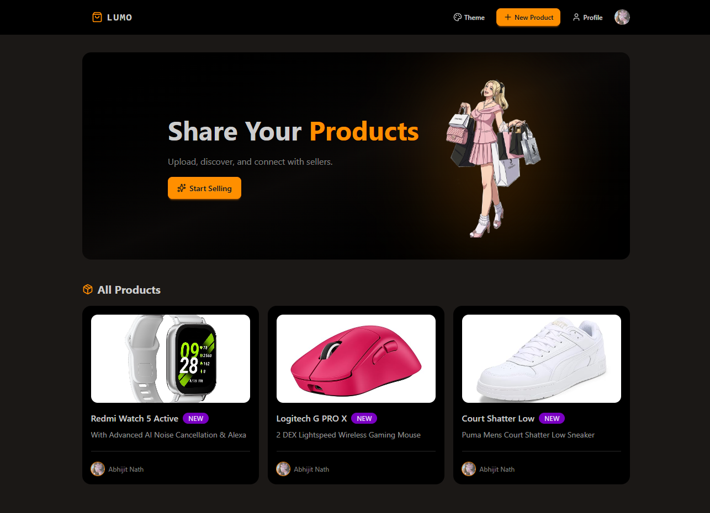
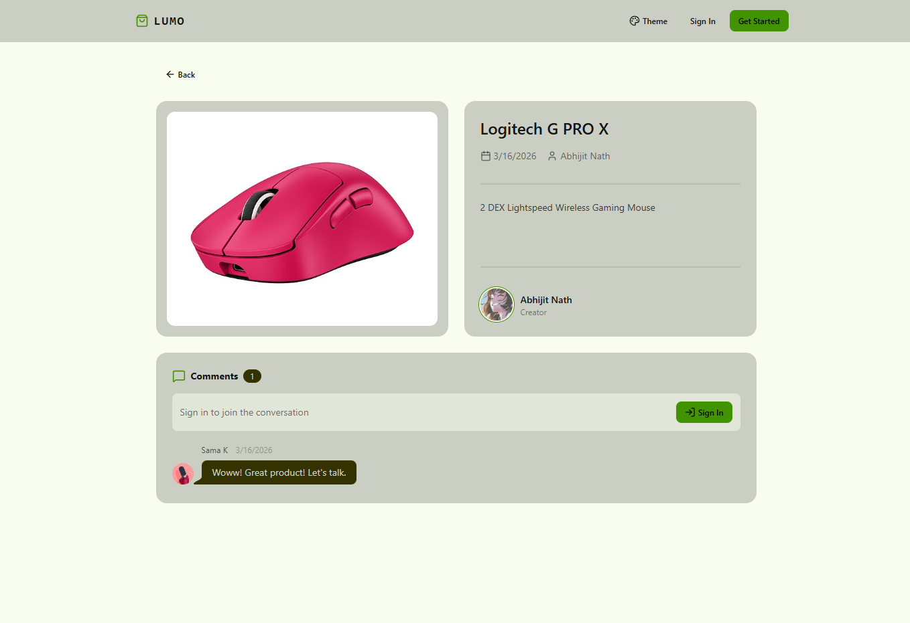
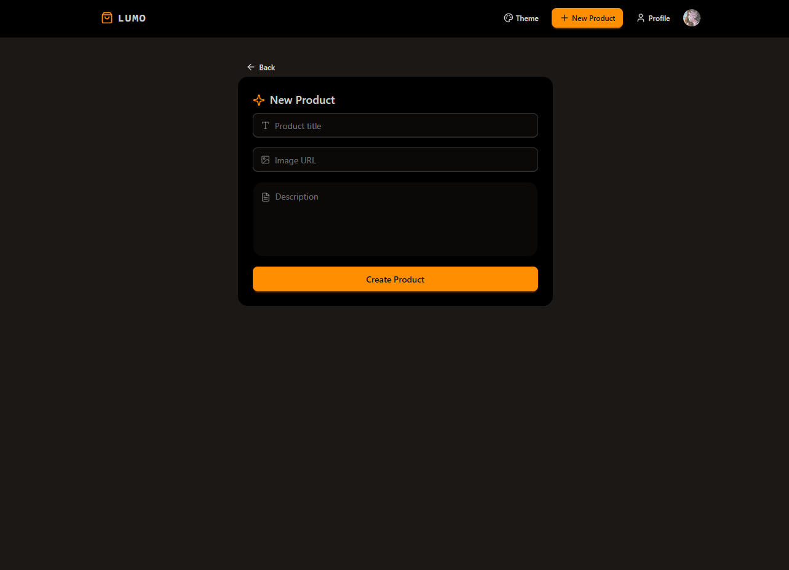
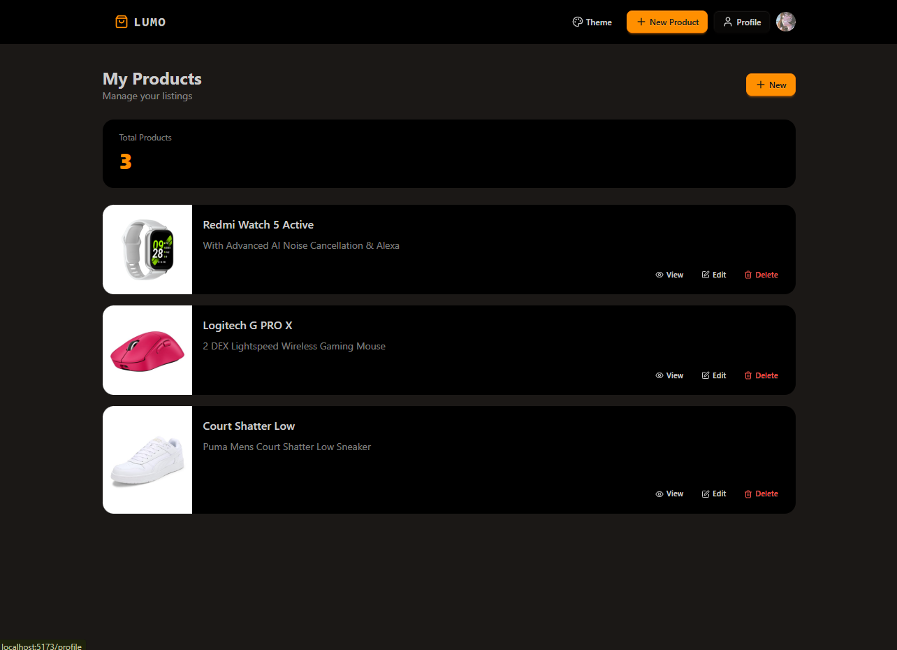

# 🛍️ Lumo Product Store

A full-stack product catalog application where users can create, manage, and explore products, along with engaging through comments.

Built to demonstrate real-world full-stack development including authentication, API integration, database management, and deployment.

---

## 🚀 Live Demo

👉 https://lumo-r44p.onrender.com

---

## ✨ Features

- 🔐 User authentication (Clerk)
- 📦 Create, edit, and delete products
- 👤 User profile with personal product listings
- 💬 Comment system on products
- 🔍 View product details
- ⚡ Real-time UI updates using React Query
- 🌐 Fully deployed full-stack application

---

## 🖼️ Screenshots





- Home Page (All Products)
- Product Details Page
- Create Product Page
- Profile Page
- Comments Feature

---

## 🧱 Tech Stack

### Frontend
- React
- React Router
- TanStack Query (React Query)
- Tailwind CSS + DaisyUI

### Backend
- Node.js
- Express.js

### Database
- PostgreSQL (Neon)
- Drizzle ORM

### Authentication
- Clerk

---

## ⚙️ Architecture Overview
```js
Frontend (React)
↓
API Requests (Axios / React Query)
↓
Backend (Express)
↓
Database (PostgreSQL via Drizzle)
```

---

## 📌 Key Concepts Used

- Server state management with React Query
- Query caching and invalidation
- RESTful API design
- Authentication and protected routes
- Full-stack deployment (Render)
- Environment-based configuration

---

## 🧠 What I Learned

- Building and structuring a full-stack application
- Managing server state efficiently with React Query
- Handling authentication with Clerk
- Debugging real-world deployment issues
- Connecting frontend, backend, and database seamlessly

---

## 🔧 Setup Instructions (Local)

```bash
# Clone the repository
git clone https://github.com/abhijit69-ui/lumo-product-store.git

# Install dependencies
npm run build

# Start the server
npm start
